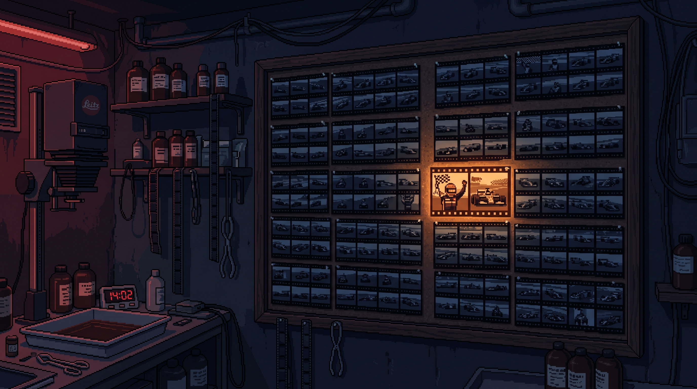

<p align="center">
  
</p>

<h1 align="center">Find me in photos</h1>

<p align="center"><strong>Find your face in a folder full of everyone else's photos.</strong></p>

<p align="center">Use a person you've already identified in Apple Photos to search a race album, event dump, or any local photo folder. Review the suggestions in your browser. Your photos and face data stay on your Mac.</p>

<p align="center">
  <a href="#how-it-works">How it works</a> ·
  <a href="#get-started">Get started</a> ·
  <a href="#read-the-results">Results</a> ·
  <a href="#privacy-and-limits">Privacy & limits</a>
</p>

---

## The whole team's photos. Just yours, please.

Someone shares a folder with hundreds of event photos. You're in a few of them, but finding those few means opening every file. Find me in photos uses an existing **Person** in your macOS Photos library as a reference, checks the faces in a folder, and builds a local review page with the likely hits at the top.

In the first 50-photo race folder, the owner confirmed all three photos flagged as strong matches. The tool still asks you to review its suggestions: face similarity is evidence, not identity proof.

## How it works

```text
Apple Photos person tags  →  local face gallery
                                      ↓
Photo folder  →  detect faces  →  compare faces  →  HTML review page + CSV/JSON
```

1. **Enroll once.** Read the photos already tagged with your name in Apple Photos and build a local gallery of face embeddings.
2. **Point it at a folder.** Scan supported images recursively, including group photos, without moving or changing the originals.
3. **Review the candidates.** Open the generated page, check the highlighted face in each photo, and use the CSV or JSON if you want to sort or script further.

Face detection uses [YuNet](https://github.com/opencv/opencv_zoo/tree/main/models/face_detection_yunet); face comparison uses [SFace](https://github.com/opencv/opencv_zoo/tree/main/models/face_recognition_sface). Both run locally through OpenCV.

## Get started

You need **macOS**, a local **Photos** library with a named Person, and [uv](https://docs.astral.sh/uv/getting-started/installation/). Setup creates a Python 3.13 environment and downloads checksum-verified model files.

```sh
git clone https://github.com/randyren278/find-me-in-photos.git
cd find-me-in-photos
./setup.sh
.venv/bin/python enroll_photos.py --person "Your name in Photos"
./find-me "/path/to/photo folder" --output "/path/to/results"
```

Open `/path/to/results/index.html` in a browser. You can omit `--output` to write into this repo's ignored `results/` folder. Re-run enrollment when you add more tagged photos to the Person.

If your library is elsewhere, pass `--library "/path/to/Photos Library.photoslibrary"` to `enroll_photos.py`. Enrollment reports how many tagged faces it could use in the private `gallery.json` file.

### No usable Photos Person?

Run `.venv/bin/python find_me.py inspect "/path/to/reference photos"` to make a face contact sheet. Place at least two **single-face crops of yourself** in `reference_faces/`, then run `./find-me` as above. The scanner uses these references when `gallery.npz` does not exist.

## Read the results

The output directory contains `index.html`, `results.csv`, `results.json`, and small preview images. Every scanned file appears in the data exports.

| Label | What it means |
| --- | --- |
| **Match** · green | Similarity at or above `0.58`; inspect the highlighted face. |
| **Review** · orange | Similarity from `0.45` to below `0.58`; check manually. |
| **Unlikely** | A face was found, but its best score was lower. |
| **No face / error** | Detection found no face, or the file could not be processed. |

Scores are **similarities, not probabilities**. Tune the cutoffs with `--threshold` and `--review-threshold` if needed. JPEG, PNG, WebP, BMP, TIFF, HEIC, and HEIF are supported; videos are not scanned.

## Privacy and limits

- **Local processing.** Enrollment reads the Photos library; scanning reads the folder you name. Neither operation uploads photos or face embeddings. Setup downloads dependencies and model files.
- **Private outputs.** The default gallery, reference, model, and result paths are ignored by Git. Keep your face gallery and exported results private when sharing the repo; use an output folder outside the repo if you prefer.
- **Human review required.** Small, turned, obscured, or poorly lit faces can be missed. Similar-looking people can be flagged. Check the photo before using or sharing a result.
- **Photos integration is macOS-specific.** Enrollment reads Apple's internal Photos database and local originals or previews. A macOS update or unavailable iCloud original may affect which tagged faces can be enrolled. The manual reference path above remains available.

---

<p align="center">Made for the moment when everyone shares the photos and you just want yours.</p>
